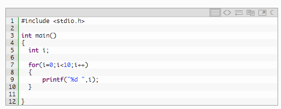
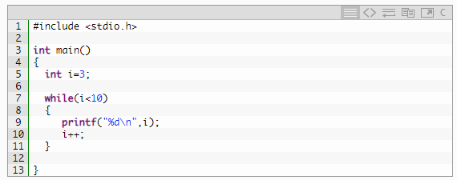
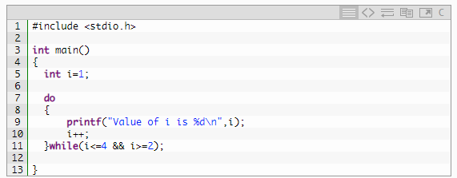
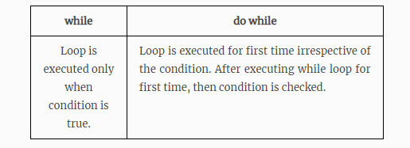

 <h1 align="center"> C – Loop control statements </h1>
 <h4>C (programming language)</h4>
 
The C programming language is a computer programming language that was developed to do system programming for the operating system       UNIX and is an imperative programming language. C was developed in the early 1970s by Ken Thompson and Dennis Ritchie at Bell Labs.

<h4>Loop control statements</h4>

 Loop control statements in C are used to perform looping operations until the given condition is true. Control comes out of the loop statements once condition becomes false. 

TYPES OF LOOP CONTROL STATEMENTS IN C:
There are 3 types of loop control statements in C language. They are, 

        1. for  
        2. while  
        3. dowhile  
        Syntax for each C loop control statements are 
        

<h4> EXAMPLE PROGRAM (FOR LOOP) IN C: </h4>
   
 In for loop control statement, loop is executed until condition becomes false. 

OUTPUT:  
0 1 2 3 4 5 6 7 8 9  

<h4> EXAMPLE PROGRAM (WHILE LOOP) IN C: </h4>
In while loop control statement, loop is executed until condition becomes false. 

OUTPUT: 
3 4 5 6 7 8 9  

<h4> EXAMPLE PROGRAM (DO WHILE LOOP) IN C: </h4>
In do..while loop control statement, while loop is executed irrespective of the condition for first time. Then 2nd time onwards, loop is executed until condition becomes false. 

OUTPUT:  
- Value of i is 1  
- Value of i is 2  
- Value of i is 3  
- Value of i is 4  

<h4> DIFFERENCE BETWEEN WHILE & DO WHILE LOOPS IN C LANGUAGE: </h4>

<h3>References:</h3>
<h4>Learnt looping statements from </h4>
<a href="https://fresh2refresh.com/c-programming/c-loop-control-statements/"> https://fresh2refresh.com/c-programming/c-loop-control-statements/  </a>  
<a href="https://simple.m.wikipedia.org/wiki/C_(programming_language)">https://simple.m.wikipedia.org/wiki/C_(programming_language)</a>   
<h4> Follow me on Facebook </h4>
<a href="https://www.facebook.com/mahender1414 ">https://www.facebook.com/mahender1414 Follow me on Instagram </a>   
<h4>Subscribe my youtube channel for more updates</h4>
<a href="https://www.youtube.com/channel/UCU-jvOwk3MCw-6DEfLpTn5A?view_as=subscriber">https://www.youtube.com/channel/UCU-jvOwk3MCw-6DEfLpTn5A?view_as=subscriber Subscribe my youtube channel for more updates</a>    
<h4> Connect with me on linkedin  </h4>
<a href="https://www.linkedin.com/in/mahenderreddy-surkanti-91315015a/">https://www.linkedin.com/in/mahenderreddy-surkanti-91315015a/ </a>   
